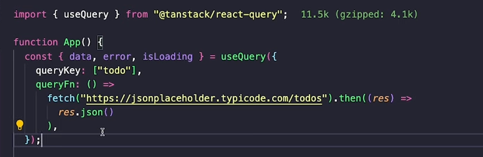

#### GraphQL


#### React query

```yarn add @tanstack/react-query```

- We find the main entry point of our application and wrap it with ```queryClientProvider```, this will give react query the access to hold the cache, manage state and other features.

- ```useQuery``` we use this whenever we want to fetch data. [GET]


- ```useMutation``` we use this for ( POST, PUT, DELETE requests) and manage their state.